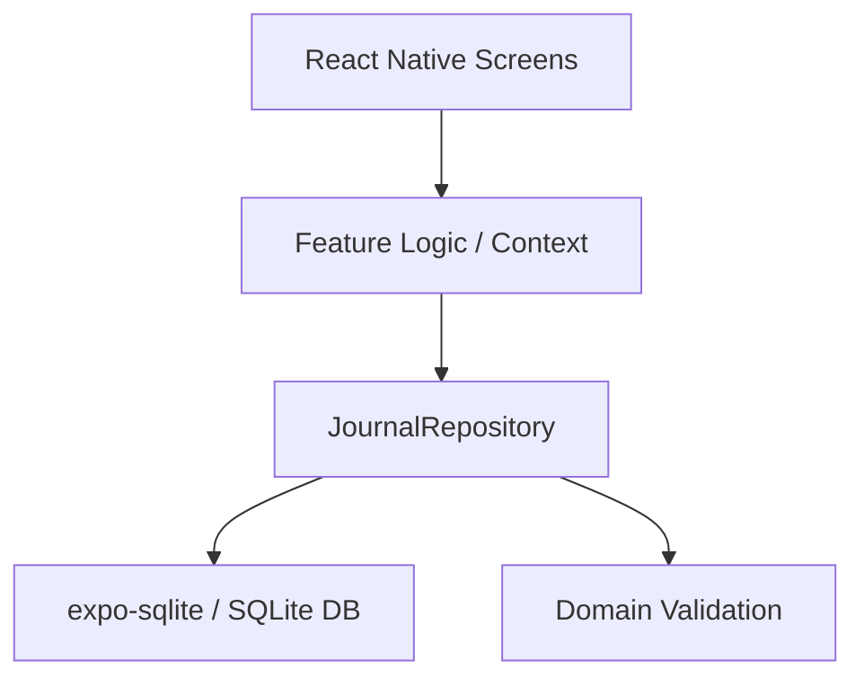
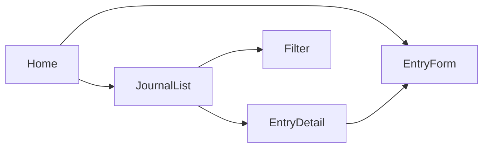

# Software Architecture Document

## Syfte och bakgrund
Appen ska hjälpa användaren att spåra mat, dryck, medicin och symptom för att kunna analysera möjliga samband med allvarliga allergiska reaktioner. Första versionen är Android-only och optimerad för snabb manuell registrering i offline-läge.

## Källunderlag
Excel-filen `reference/Matdagbok.xlsx` används som referensunderlag. Nuläget i arbetsboken:

- blad: `Lista`
- centrala kolumner: `DATUM`, `TYP`, `ANTECKNINGAR`
- cirka 151 historiska poster
- legacy-kategorier inkluderar `Mellanmål` och `Symptom`
- vissa kategorier innehåller trailing whitespace och måste trimmas vid framtida migrering

## Mål och avgränsning
Målet med v1 är att användaren snabbt ska kunna registrera och hitta poster lokalt på en Android-enhet utan backend.

Ingår i v1:

- skapa, läsa, uppdatera och radera poster
- filtrering på datumintervall, kategori och symptom
- statiska kategorier
- lokal lagring i SQLite

Ingår inte i v1:

- iOS-stöd
- molnsynk
- användarkonton
- Excel-import
- export eller backup

## Arkitekturöversikt
Appen byggs med Expo, React Native och TypeScript. Arkitekturen delas i fyra lager:

- `src/app`: navigation och appskal
- `src/features`: skärmflöden och UI-logik
- `src/data`: SQLite och repositories
- `src/domain`: typer, regler och validering



## Datamodell
V1 använder en enkel postmodell per händelse.

```ts
type CategoryType =
  | "Frukost"
  | "Lunch"
  | "Middag"
  | "Kvällsmat"
  | "Dryck"
  | "Medicin"
  | "Anteckning"
  | "Symptom";

type JournalEntry = {
  id: string;
  timestamp: string;
  category: CategoryType;
  text: string;
  symptomFlag: boolean;
  createdAt: string;
  updatedAt: string;
};

type JournalFilter = {
  from?: string;
  to?: string;
  category?: CategoryType;
  symptomsOnly?: boolean;
};
```

Regler för datamodellen:

- `timestamp`, `createdAt` och `updatedAt` lagras som ISO-8601 i UTC
- `text` är obligatorisk och får vara högst 500 tecken
- `category` är obligatorisk och måste vara en av de statiska v1-kategorierna
- `symptomFlag` används för snabb filtrering även när kategorin inte är `Symptom`

## Persistensdesign
SQLite används som lokal primär lagring i v1. Tabellen `journal_entries` indexeras på `timestamp` och `category` för snabb historik och filtrering.

```sql
CREATE TABLE journal_entries (
  id TEXT PRIMARY KEY NOT NULL,
  timestamp TEXT NOT NULL,
  category TEXT NOT NULL,
  text TEXT NOT NULL,
  symptom_flag INTEGER NOT NULL DEFAULT 0,
  created_at TEXT NOT NULL,
  updated_at TEXT NOT NULL
);
```

Repository-lagret ska exponera följande interna kontrakt:

- `createEntry(input)`
- `updateEntry(id, input)`
- `deleteEntry(id)`
- `getEntry(id)`
- `listEntries(filter)`

Migrationsstrategi i v1:

- databasen initieras med `CREATE TABLE IF NOT EXISTS`
- schemaändringar i senare versioner ska införas via explicita migrationssteg
- ingen automatisk Excel-import körs i v1

## Navigationsstruktur
- `HomeScreen`: startsida med snabbvägar
- `JournalListScreen`: dags-/historikvy
- `EntryFormScreen`: skapa och redigera post
- `EntryDetailScreen`: visa detaljer och radera
- `FilterScreen`: datum-, kategori- och symptomfilter



## Användarflöden
Primära flöden i v1:

1. Användaren öppnar startsidan och väljer `Ny post`.
2. Användaren anger tidpunkt, kategori, fritext och eventuell symptommarkering.
3. Vid giltig inmatning sparas posten lokalt och användaren skickas till historikvyn.
4. Historikvyn visar poster sorterade fallande på `timestamp`.
5. Användaren kan öppna en post, redigera den eller radera den.
6. Användaren kan filtrera på datumintervall, kategori eller endast symptommarkerade poster.

Fel- och tomtillstånd:

- valideringsfel visas innan posten sparas
- tom historik ska ge tydlig uppmaning att skapa första posten
- om en post saknas vid öppning ska detaljvyn visa att posten inte hittades

## Teknikval och motiveringar
- `Expo managed`: snabbaste vägen till Android-app utan onödig native-komplexitet
- `TypeScript`: minskar fel i domänmodell och repositorylager
- `expo-sqlite`: lokal lagring utan backend
- offline-first: hälsodata ska vara tillgänglig även utan nätverk

## Icke-funktionella krav
- appen ska fungera utan nätverksanslutning
- en ny post ska normalt kunna registreras på under 10 sekunder
- historik och filtrering ska upplevas som omedelbara för datamängder i storleksordningen några tusen poster
- data ska finnas kvar efter appomstart
- logik för datalagring och domänregler ska vara testbar utan UI

## Integritet och säkerhet
V1 saknar backend och synkar inte data. All information lagras lokalt i SQLite på enheten. Detta minskar exponering av känsliga hälsodata men innebär att export och backup behöver byggas i senare version.

Säkerhetsbeslut i v1:

- ingen känslig data får loggas i utvecklingsloggar utöver generella felmeddelanden
- ingen automatisk delning eller uppladdning av journaldata får ske
- databasen krypteras inte i v1; detta är en medveten begränsning som ska omvärderas före backup- eller synkfunktioner

## Excel- och legacyhantering
Excel-filen är referensdata i v1 och läses inte in av appen.

Normaliseringsregler som ska hållas isolerade i kodbasen för framtida migrering:

- trimma ledande och avslutande whitespace i kategorifält
- mappa `Mellanmål` till `Anteckning`
- behåll `Symptom` som egen kategori
- okända legacy-kategorier ska inte importeras utan explicit mappning

## Teststrategi och acceptanskriterier
Enhetstester ska minst täcka:

- kategorityper
- valideringsregler
- filterquery-byggande
- normalisering av legacy-kategorier

Manuell Android-verifiering ska minst täcka:

- appen startar i Expo
- ny post kan skapas och syns direkt i historiken
- redigering uppdaterar posten korrekt
- radering tar bort posten korrekt
- symptomfilter visar endast symptommarkerade poster
- data finns kvar efter omstart

V1 anses klar när:

- alla statiska kategorier finns i appen
- CRUD-flöden fungerar lokalt utan backend
- filtrering fungerar på datum, kategori och symptom
- SAD och referensfil finns i repot
- grundläggande tester passerar

## Framtida utbyggnad
- redigerbara kategorier
- import från Excel
- export och backup
- strukturerade livsmedel och läkemedel
- analys av korrelation mellan intag och symptom
- eventuell molnsynk med uttryckligt användargodkännande
